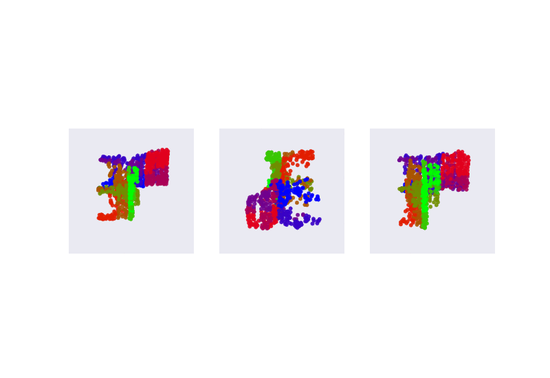

# kdt-pc-generation
Pytorch reproduction of the paper "Shape generation using spatially partitioned point clouds" by Gadelha et  al.

```info
Bibtex
@misc{gadelha2017shape,
      title={Shape Generation using Spatially Partitioned Point Clouds}, 
      author={Matheus Gadelha and Subhransu Maji and Rui Wang},
      year={2017},
      eprint={1707.06267},
      archivePrefix={arXiv},
      primaryClass={cs.CV}
}
```

## Running the code

To run the code first place the unzipped dataset in the `data` folder and proceed to run the following commands in sequence.

```code
python process_data.py
```

```code
python main.py
```


## Key Visualizations

### Before KDT


### After KDT


### SVD Reconstruction after iterative optimizer


### Some Validation Results

